[TOC]

# 腾科考核

## 写在前面

1. markdown统一格式，图片放在README.assets下

   

2. 拓扑图有更新时记得把图片更新了，文件名什么的随便搞就行，typora能看就行

3. 步骤中，每个大的步骤用**三级标题**，具体实现的小步骤加**数字标号**，同级操作(同类设备)用**普通标号**；每一步配置截图中需要框画出重要的操作(如命令、具体操作步骤等)

4. 各设备的保存：在全局模式下(输入`sy`进入用户模式，`ctrl + z`可以退出用户模式进入全局模式)，键入命令`save all`后回车，键入`y`保存配置，Git提交时连同设备的配置都要提交

## 拓扑图

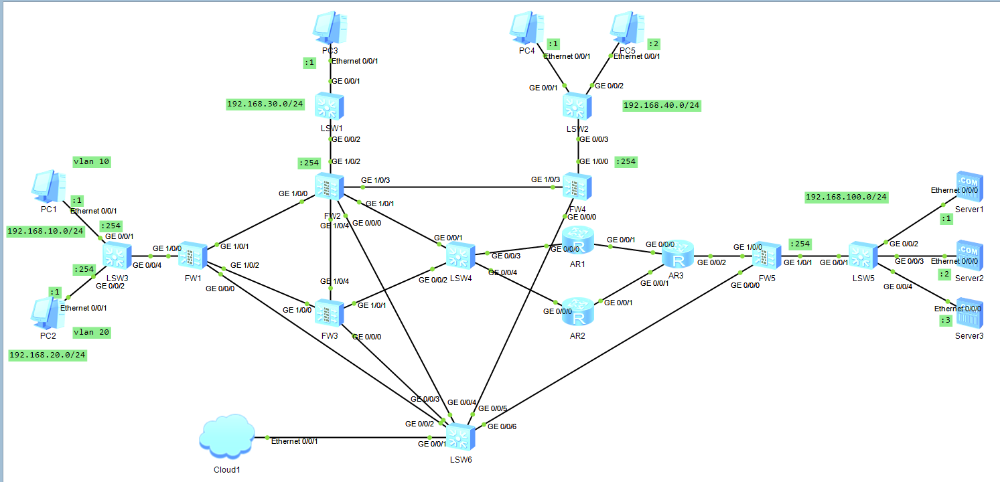

## 网络设计

1. 地址划分

   - PC1 处在vlan 10，网段：192.168.10.0/24

   - PC2 处在vlan 10，网段：192.168.20.0/24

   - PC3 网段：192.168.30.0/24

   - PC4、PC5 网段：192.168.40.0/24

   - Server1、Server2、Server3 网段：192.168.100.0/24

2. 防火墙FW1上配置单臂路由让vlan 10和vlan 20内部可以通信

## 步骤

### 各设备地址设置

- PC1

  

- PC2

  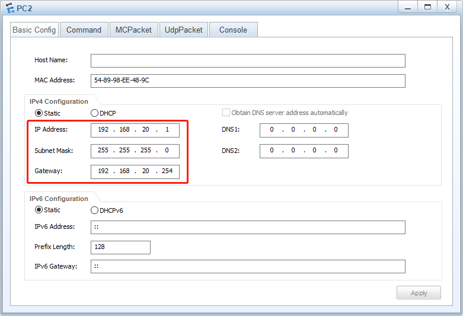

- PC3

  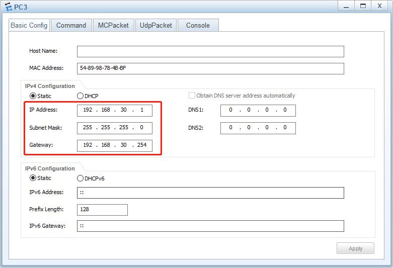

- PC4

  

- PC5

  

- Server1

  

- Server2

  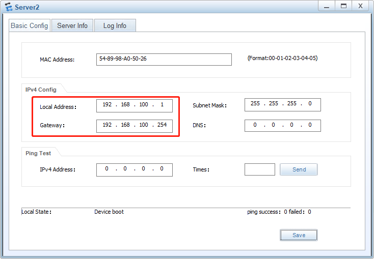

- Server3

  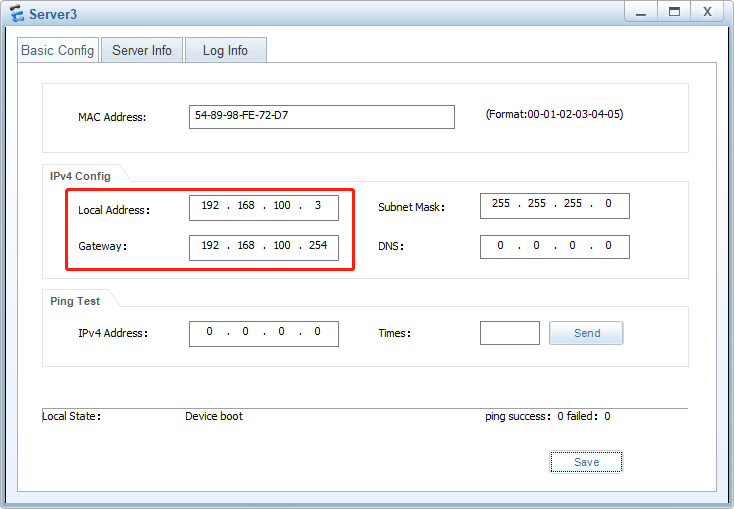

### 防火墙配置网页端访问

- FW1

  

- FW2

  

- FW3

  

- FW4

  

- FW5

  

### 配置单臂路由

1. 交换机 LSW3 配置

   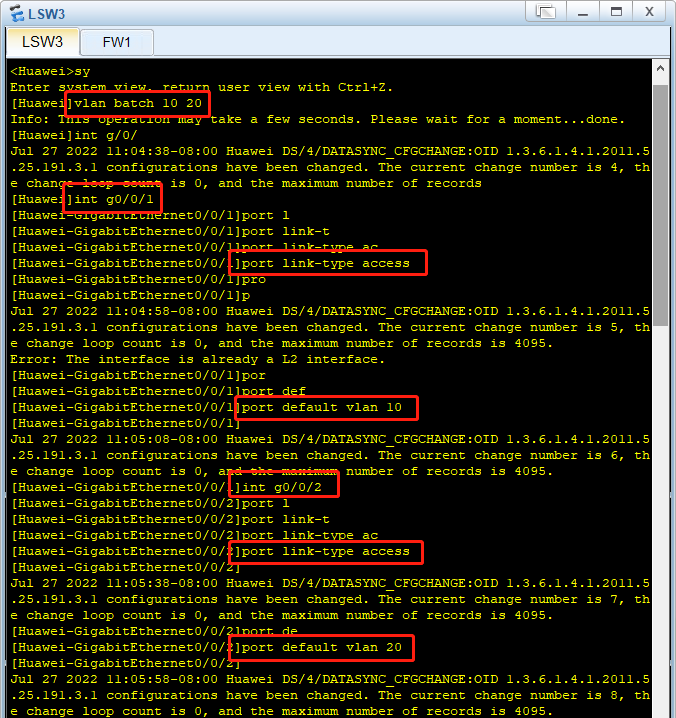

   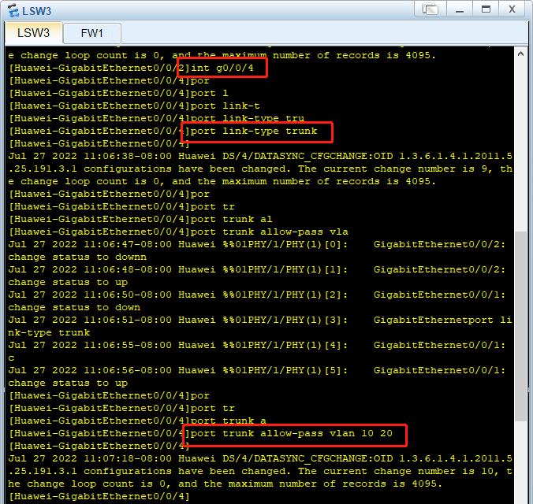

2. 防火墙 FW1 配置

   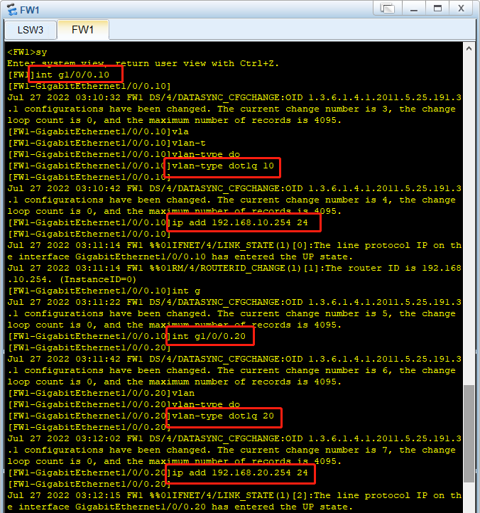

   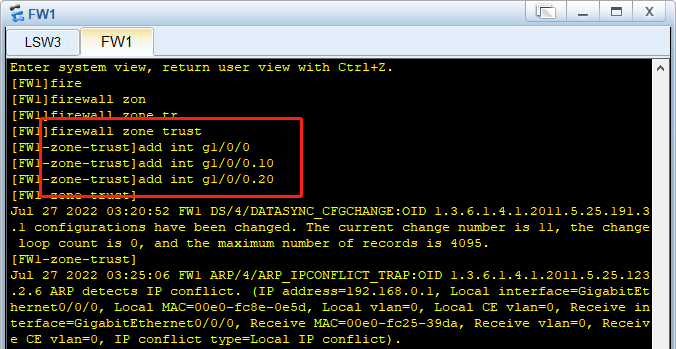

## 结果

### 各设备的配置情况

- LSW3

  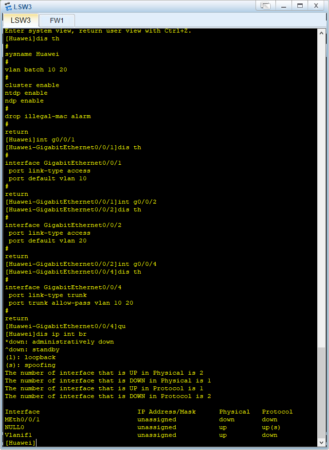

- FW1

  

### 不同vlan内主机可以互相ping通

- PC1 ping PC2

  

- PC2 ping PC1

  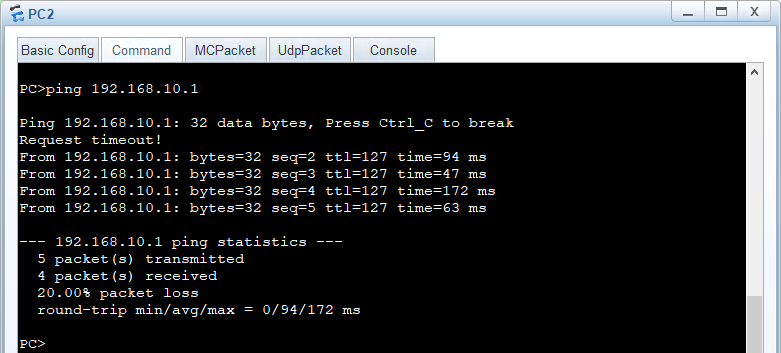

## 总结

### 徐国涛

### 张伟龙

## GitHub

[仓库地址(暂时为私密仓库，周五后会开源)](https://github.com/Country-If/ensp_final.git)

