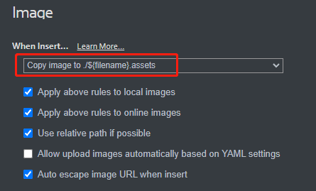
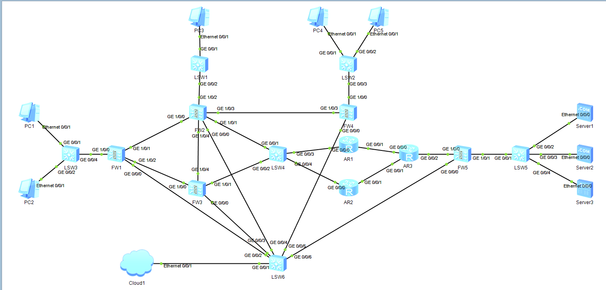
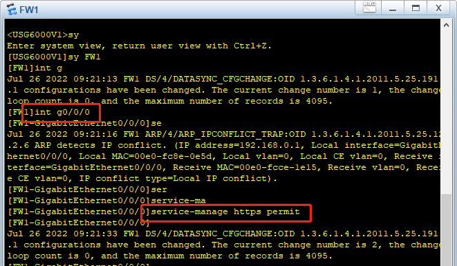
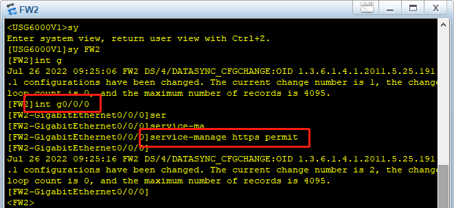
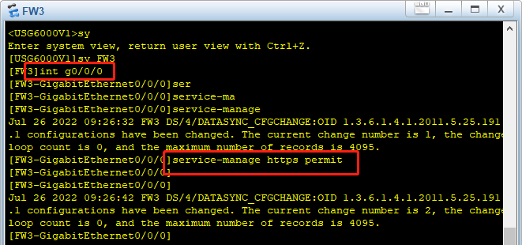
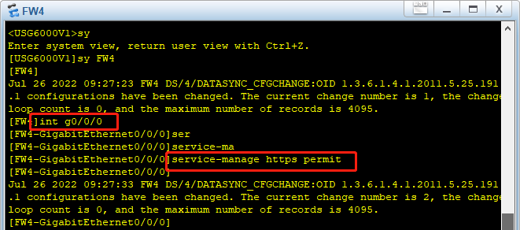
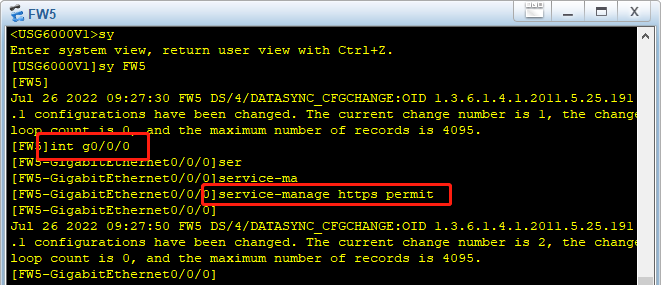

[TOC]

# ensp_final

## 写在前面

1. markdown统一格式，图片放在README.assets下

   

2. 拓扑图有更新时记得把图片更新了，文件名什么的随便搞就行，typora能看就行

3. 步骤中，每个大的步骤用三级标题，具体实现的小步骤加数字标号，同级操作(同类设备)用普通标号；每一步配置截图中需要框画出重要的操作(如命令、具体操作步骤等)

4. 各设备的保存：在全局模式下(输入`sy`进入用户模式，`ctrl + z`可以退出用户模式进入全局模式)，键入命令`save all`后回车，键入`y`保存配置，Git提交时连同设备的配置都要提交

## 拓扑图

## 步骤

### 各设备地址设置

### 防火墙配置网页端访问

- FW1

  

- FW2

  

- FW3

  

- FW4

  

- FW5

  

