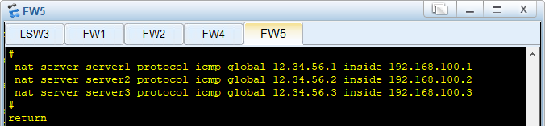
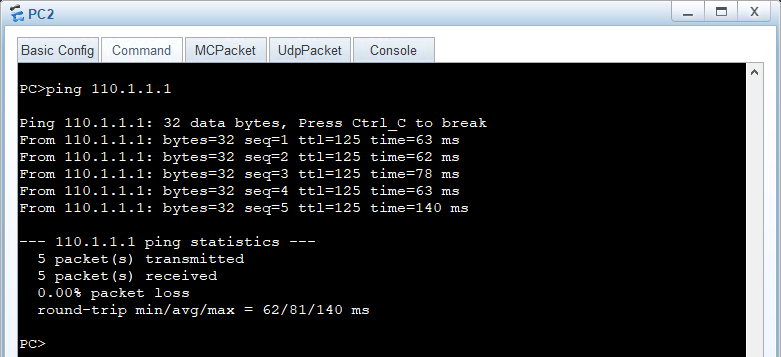

[TOC]

# 腾科考核

## 写在前面

1. markdown统一格式，图片放在README.assets下#

   

2. 拓扑图有更新时记得把图片更新了，文件名什么的随便搞就行，typora能看就行

3. 步骤中，每个大的步骤用**三级标题**，具体实现的小步骤加**数字标号**，同级操作(同类设备)用**普通标号**；每一步配置截图中需要框画出重要的操作(如命令、具体操作步骤等)

4. 各设备的保存：在全局模式下(输入`sy`进入全局模式，`ctrl + z`可以退出全局模式进入用户模式)，键入命令`save all`后回车，键入`y`保存配置，Git提交时连同设备的配置都要提交

## 拓扑图

## 网络设计

### 地址划分

- PC1 处在vlan 10，网段：192.168.10.0/24

- PC2 处在vlan 10，网段：192.168.20.0/24

- PC3 网段：192.168.30.0/24

- PC4、PC5 网段：192.168.40.0/24

- Server1、Server2、Server3 网段：192.168.100.0/24

### 配置单臂路由让vlan 10和vlan 20内部可以通信

### 安全区域划分

- FW1

  trust区域：`g1/0/0`，`g1/0/0.10`，`g1/0/0.20`

  untrust区域：`g1/0/1`，`g1/0/2`，`g1/0/3`

- FW2

  trust区域：`g1/0/2`，`g1/0/0`

  untrust区域：`g1/0/3`

- FW4

  trust区域：`g1/0/0`

  untrust区域：`g1/0/3`

- FW5

  trust区域：`g1/0/1`

  untrust区域：`g1/0/2`

## 步骤

### 各设备地址设置

- PC1

  

- PC2

  

- PC3

  

- PC4

  

- PC5

  

- PC6

  

- Server1

  

- Server2

  

- Server3

  

### 防火墙配置网页端访问

- FW1

  

  补充：g0/0/0端口ip地址不变，仍为192.168.0.1/24

- FW2

  

  补充：g0/0/0端口ip地址改为192.168.0.2/24

- FW3

  

  补充：g0/0/0端口ip地址改为192.168.0.3/24

- FW4

  

  补充：g0/0/0端口ip地址改为192.168.0.4/24

- FW5

  
  
  补充：g0/0/0端口ip地址改为192.168.0.5/24

### 配置单臂路由

1. 交换机 LSW3 配置

   

   

2. 防火墙 FW1 配置

   

   

### 配置IPSec VPN

1. 基础配置、接口地址以及安全区域

   - FW2

     

   - FW4

     

2. 配置到对端的路由

   - FW2

     

   - FW4

     

3. 配置相关的安全策略，允许网络A与网络B互访，允许IKE协商报文及加密报文通过

   - FW2

     

   - FW4

     

4. 配置IPSec策略

   - FW2

     

   - FW4

     

5. 防火墙配置安全策略

   - FW2

     

   - FW4

     

### 在配置IPSec VPN的基础上添加优先规则拒绝PC5出站

1. 添加拒绝PC5出站的安全策略，并将其移到顶部

   

2. 查看安全策略，可以看到上面定义的规则确实已在顶部

   

### 防火墙使用NAT技术

1. Server组使用公网地址(12.34.56.0/24)代表内部服务器对外地址

   1. 划分安全区域以及接口地址配置

      

      

   2. 添加安全策略

      

   3. 添加nat策略

      

2. 防火墙FW1配置easy-ip让内部pc可以访问外网

   - FW1配置

     

### 配置OSPF

- AR1

  

- AR2

  

- AR3

  

  补充：修改`g0/0/2`端口ip地址为110.1.1.254/24

- FW1

  
  
  

## 结果

### 各设备的配置情况

- LSW3

  

- FW1

  

### 不同vlan内主机可以互相ping通

- PC1 ping PC2

  

- PC2 ping PC1

  

### IPSec配置后的主机通信

- PC3 ping PC4、PC5

  

- PC4 ping PC3

  

### 拒绝PC5出站

- PC5 ping 本地环境下的PC4以及外部网络中的PC3

  

### OSPF

- PC1和PC2 ping PC6

  

  

## 答辩演示

- PC1和PC2可以互相ping通
- PC4可以ping通PC3，PC5不可以ping通PC3
- PC1可以ping

## 总结

### 徐国涛

### 张伟龙

## GitHub

[仓库地址(暂时为私密仓库，周五后会开源)](https://github.com/Country-If/ensp_final.git)

